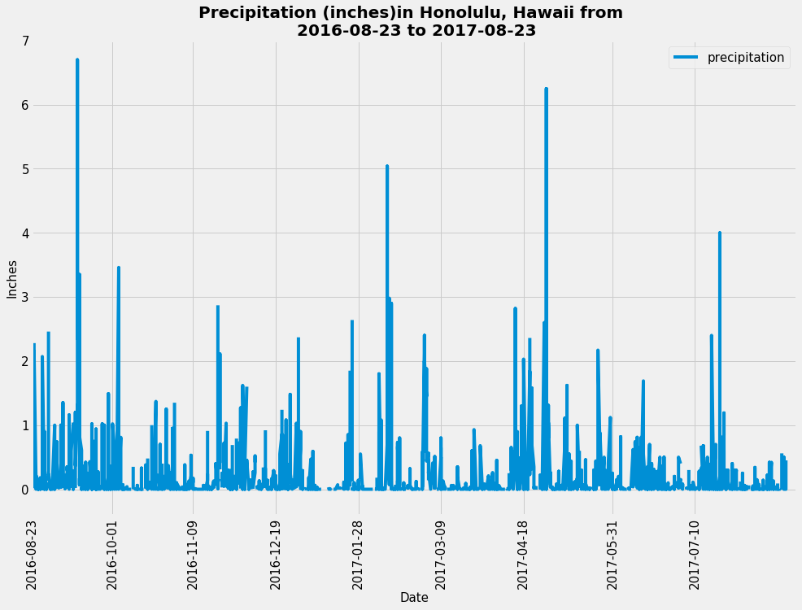

# SQLAlchemy Homework - Surfs Up!

### Background

This repository is designed to make a climate analysis on Honolulu, Hawaii, to help clients trip planning, and help to outline what they need to do.

## Step 1 - Climate Analysis and Exploration

This project used a Python and SQLAlchemy to make climate analysis, and data exploration of the climate database. All of the following analysis completed by using SQLAlchemy ORM queries, Pandas, and Matplotlib. The complete climate analysis, and data exploration with python pandas notebook file found here [starter notebook](climate_starter.ipynb), and the SQLAlchemy file is also provided here [hawaii.sqlite](Resources/hawaii.sqlite).

* By using SQLAlchemy an engin created `create_engine` to connect to the sqlite database.
` engine = create_engine("sqlite:///Resources/hawaii.sqlite")
inspector = inspect(engine) `

* To reflect the tables into classes and save a reference to those classes called `Station` and `Measurement` an SQLAlchemy `automap_base()` used.

### Precipitation Analysis

* A query is designed to retrieve the last 12 months of precipitation data, and only the `date` and `prcp` values is slected.

* The query results also loded into a Pandas DataFrame and the index is seted in to the date column, and sorted the DataFrame values by `date`.

* Finally the result ploted by using the DataFrame `plot` method.The plot looks as follows:

  

* By using the Pandas the summary statistics for the precipitation data was performed and diplayed. 

### Station Analysis

* A query is designed to calculate the total number of stations at result 9 stations found, and to find the most active stations the stations list, and observation counts is sorted in descending order. Station `USC00519281` has the highest number of observations.

* A query is created to retrieve the last 12 months of temperature observation data (TOBS) and filter by the station with the highest number of observations. The Plot for the results as a histogram with `bins=12` were created and it looks as follows. 

- - -

## Step 2 - Climate App

After the initial analysis was completed, a Flask API designed based on the queries already developed.

* The following routes are created by using Flask. To look and run the code click the following link:[app.py](app.py)

### Routes

* `/`

  * Home page.

  * List all routes that are available.

* `/api/v1.0/precipitation`

  * Convert the query results to a dictionary using `date` as the key and `prcp` as the value.

  * Return the JSON representation of your dictionary.

* `/api/v1.0/stations`

  * Return a JSON list of stations from the dataset.

* `/api/v1.0/tobs`
  * Query the dates and temperature observations of the most active station for the last year of data.
  
  * Return a JSON list of temperature observations (TOBS) for the previous year.

* `/api/v1.0/<start>` and `/api/v1.0/<start>/<end>`

  * Return a JSON list of the minimum temperature, the average temperature, and the max temperature for a given start or start-end range.

  * When given the start only, calculate `TMIN`, `TAVG`, and `TMAX` for all dates greater than and equal to the start date.

  * When given the start and the end date, calculate the `TMIN`, `TAVG`, and `TMAX` for dates between the start and end date inclusive.

## Hints

* You will need to join the station and measurement tables for some of the queries.

* Use Flask `jsonify` to convert your API data into a valid JSON response object.

- - -

## Bonus: Other Recommended Analyses

* The following are optional challenge queries. These are highly recommended to attempt, but not required for the homework.

### Temperature Analysis I

* Hawaii is reputed to enjoy mild weather all year. Is there a meaningful difference between the temperature in, for example, June and December?

* You may either use SQLAlchemy or pandas's `read_csv()` to perform this portion.

* Identify the average temperature in June at all stations across all available years in the dataset. Do the same for December temperature.

* Use the t-test to determine whether the difference in the means, if any, is statistically significant. Will you use a paired t-test, or an unpaired t-test? Why?

### Temperature Analysis II

* The starter notebook contains a function called `calc_temps` that will accept a start date and end date in the format `%Y-%m-%d`. The function will return the minimum, average, and maximum temperatures for that range of dates.

* Use the `calc_temps` function to calculate the min, avg, and max temperatures for your trip using the matching dates from the previous year (i.e., use "2017-01-01" if your trip start date was "2018-01-01").

* Plot the min, avg, and max temperature from your previous query as a bar chart.

  * Use the average temperature as the bar height.

  * Use the peak-to-peak (TMAX-TMIN) value as the y error bar (YERR).

    

### Daily Rainfall Average

* Calculate the rainfall per weather station using the previous year's matching dates.

* Calculate the daily normals. Normals are the averages for the min, avg, and max temperatures.

* You are provided with a function called `daily_normals` that will calculate the daily normals for a specific date. This date string will be in the format `%m-%d`. Be sure to use all historic TOBS that match that date string.

* Create a list of dates for your trip in the format `%m-%d`. Use the `daily_normals` function to calculate the normals for each date string and append the results to a list.

* Load the list of daily normals into a Pandas DataFrame and set the index equal to the date.

* Use Pandas to plot an area plot (`stacked=False`) for the daily normals.

  

### Copyright

Trilogy Education Services © 2020. All Rights Reserved.
